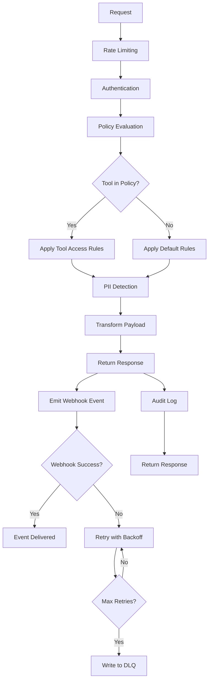
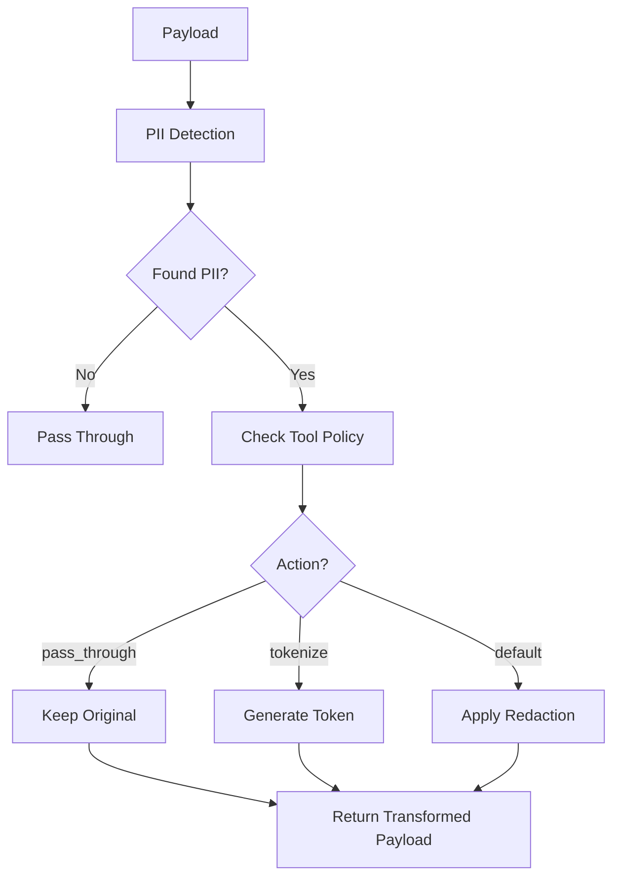

# GovernsAI Precheck - Project Specifications

## Overview

GovernsAI Precheck is a policy evaluation and PII redaction service that provides real-time policy decisions and data sanitization for AI tool interactions. The service supports per-tool PII access controls, allowing different tools to have specific rules for handling sensitive data.

## Core Features

### 1. Policy Evaluation Engine
- **Tool-based policies**: Different rules for different AI tools
- **Scope-based policies**: Network scope restrictions (e.g., `net.external`)
- **PII detection**: Advanced PII detection using Presidio with fallback to regex
- **Real-time decisions**: Fast policy evaluation with sub-second response times

### 2. Per-Tool PII Access Control
- **Tool-specific allowlists**: Configure which PII types each tool can access
- **Transform actions**: Support for `pass_through`, `tokenize`, and default redaction
- **Stable tokenization**: HMAC-based consistent token generation
- **Policy configuration**: YAML-based policy files for easy management

### 3. PII Detection & Redaction
- **Presidio integration**: Advanced NLP-based PII detection
- **Fallback detection**: Regex-based detection when Presidio unavailable
- **Multiple PII types**: Email, SSN, phone numbers, credit cards, API keys, JWT tokens
- **False positive filtering**: Context-aware filtering to reduce false positives

### 4. Event Emission & Monitoring
- **Webhook events**: Real-time policy decision events with HMAC authentication
- **Dead Letter Queue (DLQ)**: Failed webhook deliveries stored in JSONL format
- **Retry logic**: Exponential backoff with configurable retry attempts
- **Event schema**: Versioned event format for backward compatibility

### 5. Failure Contract & Error Handling
- **Configurable error behavior**: `block`, `pass`, or `best_effort` modes
- **Graceful degradation**: Fallback strategies when policy evaluation fails
- **HTTP status codes**: Proper error responses with structured reasons

### 6. Audit Logging & Governance
- **Structured JSON logs**: One line per request for easy parsing
- **Provable governance**: Complete audit trail without database dependency
- **Log shipping ready**: Compatible with Loki/Datadog ingestion

### 7. Policy Hot-Reload
- **Live policy updates**: Reload policies without service restart
- **File change detection**: Automatic reload when policy file is modified
- **Global defaults**: Organization-wide policy stance configuration

## API Documentation

### OpenAPI Specification
The complete API specification is available in OpenAPI 3.1.0 format:
- **File**: `openapi.json` (included in repository)
- **Interactive Docs**: `http://localhost:8080/docs` (Swagger UI)
- **Alternative Docs**: `http://localhost:8080/redoc` (ReDoc)
- **Schema**: `http://localhost:8080/openapi.json` (JSON schema)

### Policy Precedence in API Responses
All API responses include a `policy_id` field that indicates which precedence level was applied:
- **`deny-exec`**: DENY_TOOLS level (highest priority)
- **`tool-access`**: TOOL_SPECIFIC level
- **`defaults`**: GLOBAL_DEFAULTS level
- **`net-redact-presidio`** or **`net-redact-regex`**: NETWORK_SCOPE level
- **`default-redact`**: SAFE_FALLBACK level (lowest priority)

## API Endpoints

### Health Check
```
GET /v1/health
```

**Response**:
```json
{
  "ok": true,
  "service": "governsai-precheck",
  "version": "0.0.1"
}
```

### Readiness Check
```
GET /v1/ready
```

**Purpose**: Comprehensive readiness check for Kubernetes probes and service validation

**Response**:
```json
{
  "ready": true,
  "service": "governsai-precheck",
  "version": "0.0.1",
  "checks": {
    "presidio": {"status": "ok", "message": "..."},
    "policy": {"status": "ok", "message": "..."},
    "policy_file": {"status": "ok", "message": "..."},
    "environment": {"status": "ok", "message": "..."},
    "dlq": {"status": "ok", "message": "..."}
  },
  "timestamp": 1758812000
}
```

### Prometheus Metrics
```
GET /metrics
```

**Purpose**: Prometheus metrics endpoint for monitoring and alerting

**Response**: Prometheus text format with counters, histograms, and gauges

### Precheck Endpoint
```
POST /v1/u/{user_id}/precheck
```

**Purpose**: Evaluate policy and sanitize raw text before tool execution

**Authentication**: API key passed via `X-Governs-Key` header (forwarded to WebSocket for authentication)

**Request**:
```json
{
  "tool": "verify_identity",
  "scope": "net.external",
  "raw_text": "User email: alice@example.com, SSN: 123-45-6789",
  "corr_id": "req-123",
  "tags": ["urgent", "customer"]
}
```

**Response**:
```json
{
  "decision": "transform",
  "raw_text_out": "User email: alice@example.com, SSN: pii_8797942a",
  "reasons": [
    "pii.allowed:PII:email_address",
    "pii.tokenized:PII:us_ssn"
  ],
  "policy_id": "tool-access",
  "ts": 1758745697
}
```

### Postcheck Endpoint
```
POST /v1/u/{user_id}/postcheck
```

**Purpose**: Validate and sanitize raw text after tool execution (egress)

**Authentication**: API key passed via `X-Governs-Key` header (forwarded to WebSocket for authentication)

**Request/Response**: Same format as precheck

### Health Check
```
GET /v1/health
```

**Response**:
```json
{
  "ok": true,
  "service": "governsai-precheck",
  "version": "0.0.1"
}
```

### Readiness Check
```
GET /v1/ready
```

**Purpose**: Comprehensive readiness check for Kubernetes probes and service validation

**Response**:
```json
{
  "ready": true,
  "service": "governsai-precheck",
  "version": "0.0.1",
  "checks": {
    "presidio": {
      "status": "ok",
      "message": "Presidio analyzer and anonymizer initialized"
    },
    "policy": {
      "status": "ok", 
      "message": "Policy loaded with 3 sections"
    },
    "policy_file": {
      "status": "ok",
      "message": "Policy file exists: policy.tool_access.yaml"
    },
    "environment": {
      "status": "ok",
      "message": "Environment variables: {'PII_TOKEN_SALT': 'ok', 'ON_ERROR': 'ok'}"
    },
    "dlq": {
      "status": "ok",
      "message": "DLQ directory accessible: /tmp"
    }
  },
  "timestamp": 1758812000
}
```

**Readiness Checks**:
- **Presidio**: Analyzer and anonymizer initialization status
- **Policy**: Policy file parsing and validation
- **Policy File**: File existence and accessibility
- **Environment**: Critical environment variables availability
- **DLQ**: Dead letter queue directory accessibility

**Status Values**:
- `"ok"`: Check passed successfully
- `"warning"`: Check passed with warnings
- `"error"`: Check failed, service not ready
- `"disabled"`: Check not applicable (e.g., Presidio disabled)

### Prometheus Metrics
```
GET /metrics
```

**Purpose**: Prometheus metrics endpoint for monitoring and alerting

**Response**: Prometheus text format with counters, histograms, and gauges

**Key Metrics**:

#### Counters
- `precheck_requests_total{user_id, tool, decision, policy_id}` - Total precheck requests
- `postcheck_requests_total{user_id, tool, decision, policy_id}` - Total postcheck requests  
- `pii_detections_total{pii_type, action}` - Total PII detections
- `policy_evaluations_total{tool, direction, policy_id}` - Total policy evaluations
- `webhook_events_total{event_type, status}` - Total webhook events emitted
- `dlq_events_total{error_type}` - Total DLQ events

#### Histograms
- `precheck_duration_seconds{user_id, tool}` - Precheck request duration
- `postcheck_duration_seconds{user_id, tool}` - Postcheck request duration
- `policy_evaluation_duration_seconds{tool, policy_id}` - Policy evaluation duration
- `pii_detection_duration_seconds{pii_type}` - PII detection duration
- `webhook_duration_seconds{status}` - Webhook request duration

#### Gauges
- `active_requests{endpoint}` - Number of active requests
- `policy_cache_size` - Number of policies in cache
- `dlq_size` - Number of events in DLQ

#### Info
- `precheck_service_info{version, build_date, git_commit}` - Service information

## Event Schema

### Policy Decision Event
Every policy decision emits a webhook event with the following schema:

```json
{
  "type": "INGEST",
  "channel": "org:YOUR_ORG:decisions",
  "schema": "decision.v1",
  "idempotencyKey": "precheck-1735229123456-abc123def",
  "data": {
    "orgId": "YOUR_ORG_ID",
    "direction": "precheck",
    "decision": "transform",
    "tool": "verify_identity",
    "scope": "net.external",
    "detectorSummary": {
      "reasons": ["pii.allowed:PII:email_address","pii.tokenized:PII:us_ssn"],
      "confidence": 0.85,
      "piiDetected": ["email_address", "us_ssn"]
    },
    "payloadHash": "sha256:a1b2c3d4e5f6...",
    "latencyMs": 45,
    "correlationId": "req-123",
    "tags": ["production", "api-call"],
    "ts": "2024-12-26T10:15:30.123Z",
    "authentication": {
      "userId": "u1",
      "apiKey": "GAI_LOCAL_DEV_ABC"
    }
  }
}
```

### Event Fields

#### Top-Level Fields
- **`type`**: Event type, always `"INGEST"` for decision events
- **`channel`**: WebSocket channel format `"org:{ORG_ID}:decisions"`
- **`schema`**: Schema version, currently `"decision.v1"`
- **`idempotencyKey`**: Unique key for deduplication (format: `{direction}-{timestamp}-{correlation_id}`)

#### Data Fields
- **`orgId`**: Organization identifier (configurable via `ORG_ID` environment variable)
- **`direction`**: `"precheck"` for ingress, `"postcheck"` for egress
- **`decision`**: Policy decision (`allow`, `deny`, `transform`)
- **`tool`**: Tool name from the request
- **`scope`**: Network scope from the request
- **`detectorSummary`**: PII detection results and confidence
  - **`reasons`**: Array of reason codes explaining the decision
  - **`confidence`**: Calculated confidence score (0.0-1.0) based on PII detection actions
  - **`piiDetected`**: Array of detected PII types (e.g., `["email_address", "us_ssn"]`)
- **`payloadHash`**: SHA256 hash of the request payload for integrity verification
- **`latencyMs`**: Processing time in milliseconds
- **`correlationId`**: Correlation ID for request tracking
- **`tags`**: Array of strings for categorization (currently empty, configurable)
- **`ts`**: ISO 8601 timestamp of the decision
- **`authentication`**: Authentication information from the request
  - **`userId`**: User ID extracted from the URL path parameter
  - **`apiKey`**: API key from the request header

### WebSocket Webhook Integration

The service uses WebSocket connections to send webhook events instead of HTTP POST requests:

**URL Format**: `ws://host:port/api/ws/gateway?key=API_KEY&org=ORG_ID&channels=CHANNEL_LIST`

**Example**:
```
ws://172.16.10.59:3002/api/ws/gateway?key=gai_827eode3nxa&org=dfy&channels=org:cmfzriajm0003fyp86ocrgjoj:decisions,org:cmfzriajm0003fyp86ocrgjoj:postcheck,org:cmfzriajm0003fyp86ocrgjoj:dlq,org:cmfzriajm0003fyp86ocrgjoj:precheck,org:cmfzriajm0003fyp86ocrgjoj:approvals,user:cmfzriaip0000fyp81gjfkri9:notifications
```

**Parsed Values**:
- **`orgId`**: Extracted from `org` parameter (`dfy`)
- **`channel`**: Extracted from `channels` parameter, finds the `:decisions` channel (`org:cmfzriajm0003fyp86ocrgjoj:decisions`)
- **`apiKey`**: Extracted from `key` parameter (`gai_827eode3nxa`)

**Dynamic Configuration**: All values are dynamically extracted from the webhook URL. If parsing fails or required values (`orgId` or `channel`) are not found in the URL, webhook emission is skipped with a warning message. The service will still process the request and return a response, but no webhook event will be emitted.

## Policy Configuration

### Tool Access Policy (`policy.tool_access.yaml`)

```yaml
version: v1
defaults:
  ingress:
    action: redact  # or deny | pass_through | tokenize
  egress:
    action: redact

tool_access:
  verify_identity:
    direction: ingress         # only apply on precheck
    allow_pii:
      PII:email_address: pass_through  # tool may receive raw email
      PII:us_ssn: tokenize        # tool must get token, not raw
  send_marketing_email:
    direction: ingress
    allow_pii:
      PII:email_address: pass_through
  data_export:
    direction: egress          # only apply on postcheck
    allow_pii:
      PII:email_address: pass_through  # allow email in export
      PII:us_ssn: tokenize        # tokenize SSN in export
  audit_log:
    direction: egress          # only apply on postcheck
    allow_pii:
      PII:email_address: pass_through  # allow email in audit logs
      # SSN will be redacted (default behavior)
# default: everything else redacts/denies (your current behavior)
```

### Policy Actions

- **`pass_through`**: Allow raw PII value to pass through unchanged
- **`tokenize`**: Replace PII with stable token (e.g., `pii_8797942a`)
- **`redact`**: Apply standard redaction (e.g., `<USER_EMAIL>`, `<USER_SSN>`)
- **`deny`**: Block the request entirely

### Global Defaults

The policy file supports global defaults for each direction:
- **`ingress`**: Default action for precheck requests
- **`egress`**: Default action for postcheck requests
- **Tool-specific rules** override global defaults
- **Fallback**: Safe redaction if no rules apply

## Policy Precedence Rules

The policy evaluation system follows a strict precedence hierarchy (highest to lowest priority):

### 1. **DENY_TOOLS** (Highest Priority)
- **Purpose**: Hard deny for dangerous tools
- **Tools**: `python.exec`, `bash.exec`, `code.exec`, `shell.exec`
- **Decision**: Always `deny`
- **Policy ID**: `deny-exec`
- **Reason**: `blocked tool: code/exec`

### 2. **TOOL_SPECIFIC** (High Priority)
- **Purpose**: Tool-specific rules in `policy.tool_access.yaml`
- **Condition**: Tool exists in `tool_access` section and direction matches
- **Actions**: `pass_through`, `tokenize`, `redact`, `deny`
- **Policy ID**: `tool-access`
- **Override**: Takes precedence over all lower levels

### 3. **GLOBAL_DEFAULTS** (Medium Priority)
- **Purpose**: Global defaults for direction (ingress/egress)
- **Condition**: No tool-specific rule applies
- **Actions**: `pass_through`, `tokenize`, `redact`, `deny`
- **Policy ID**: `defaults`
- **Override**: Takes precedence over network scope and fallback

### 4. **NETWORK_SCOPE** (Low Priority)
- **Purpose**: Network scope redaction for external tools
- **Condition**: Scope starts with `net.` or tool starts with `web.`, `http.`, `fetch.`, `request.`
- **Actions**: Always `redact` (PII detection and redaction)
- **Policy ID**: `net-redact-presidio` or `net-redact-regex`
- **Override**: Takes precedence over safe fallback

### 5. **SAFE_FALLBACK** (Lowest Priority)
- **Purpose**: Default redaction for all other cases
- **Condition**: No other rules apply
- **Actions**: Always `redact` (PII detection and redaction)
- **Policy ID**: `default-redact`
- **Override**: Final fallback for safety

### Precedence Examples

| Tool | Scope | Direction | Rule Applied | Policy ID | Reason |
|------|-------|-----------|--------------|-----------|---------|
| `python.exec` | `net.external` | `ingress` | DENY_TOOLS | `deny-exec` | `blocked tool: code/exec` |
| `verify_identity` | `net.external` | `ingress` | TOOL_SPECIFIC | `tool-access` | `pii.allowed:PII:email_address` |
| `unknown_tool` | `net.external` | `ingress` | GLOBAL_DEFAULTS | `defaults` | `default.ingress.redact` |
| `web.fetch` | `internal` | `ingress` | NETWORK_SCOPE | `net-redact-presidio` | `pii.redacted:email_address` |
| `random_tool` | `internal` | `ingress` | SAFE_FALLBACK | `default-redact` | `pii.redacted:email_address` |

### Policy Directions

- **`ingress`**: Apply only on precheck (before tool execution)
- **`egress`**: Apply only on postcheck (after tool execution)

## PII Detection

### Supported PII Types

| PII Type | Presidio Entity | Example |
|----------|----------------|---------|
| Email | `EMAIL_ADDRESS` | `alice@example.com` |
| SSN | `US_SSN` | `123-45-6789` |
| Phone | `PHONE_NUMBER` | `+1-555-123-4567` |
| Credit Card | `CREDIT_CARD` | `4111-1111-1111-1111` |
| API Key | `API_KEY` | `sk-1234567890abcdef` |
| JWT Token | `JWT_TOKEN` | `eyJhbGciOiJIUzI1NiIs...` |

### Detection Methods

1. **Presidio (Primary)**: Advanced NLP-based detection with custom recognizers
2. **Regex (Fallback)**: Pattern-based detection when Presidio unavailable
3. **Context-aware filtering**: Reduces false positives based on field names and patterns

## Tokenization

### Stable Token Generation

```python
def tokenize(value: str) -> str:
    """Create a stable token for PII values"""
    return f"pii_{hashlib.sha256((TOKEN_SALT + value).encode()).hexdigest()[:8]}"
```

### Token Properties

- **Format**: `pii_{8-char-hash}`
- **Stable**: Same input always produces same token
- **Configurable salt**: Set via `PII_TOKEN_SALT` environment variable
- **Privacy-preserving**: Cannot reverse-engineer original value without salt

### Example Tokens

| Original Value | Token |
|----------------|-------|
| `alice@example.com` | `pii_a70ae1e6` |
| `123-45-6789` | `pii_8797942a` |
| `+1-555-123-4567` | `pii_b82c4f1d` |

## Architecture

### Core Components

```
app/
├── main.py          # FastAPI application entry point
├── api.py           # API endpoints and webhook handling
├── models.py        # Pydantic models for requests/responses
├── policies.py      # Policy evaluation and PII processing
├── events.py        # Event emission and DLQ handling
├── log.py           # Structured audit logging
├── auth.py          # API key authentication
├── rate_limit.py    # Rate limiting implementation
├── storage.py       # Data persistence layer
└── settings.py      # Configuration management
```

### Policy Evaluation Flow



### PII Processing Flow



## Configuration

### Environment Variables

| Variable | Description | Default |
|----------|-------------|---------|
| `PII_TOKEN_SALT` | Salt for token generation | `default-salt-change-in-production` |
| `PRECHECK_DLQ` | Dead letter queue path | `/tmp/precheck.dlq.jsonl` |
| `WEBHOOK_URL` | Webhook URL for events | None |
| `WEBHOOK_SECRET` | Secret for HMAC signing | `dev-secret` |
| `WEBHOOK_TIMEOUT_S` | Webhook request timeout | `2.5` |
| `WEBHOOK_MAX_RETRIES` | Maximum retry attempts | `3` |
| `WEBHOOK_BACKOFF_BASE_MS` | Base backoff delay in ms | `150` |
| `ON_ERROR` | Error handling behavior | `block` |
| `POLICY_FILE` | Policy file path | `policy.tool_access.yaml` |
| `USE_PRESIDIO` | Enable Presidio PII detection | `true` |
| `PRESIDIO_MODEL` | spaCy model for Presidio | `en_core_web_sm` |

### API Configuration

| Variable | Description | Default |
|----------|-------------|---------|
| `DEMO_API_KEY` | Demo API key for testing | `GAI_LOCAL_DEV_ABC` |
| `API_KEY_HEADER` | Header name for API key | `X-Governs-Key` |

## Security Features

### Authentication
- API key passed to WebSocket for authentication handling
- No API-level authentication enforcement
- API key extracted from `X-Governs-Key` header and forwarded to webhook events

### Rate Limiting
- 100 requests per minute per user
- Configurable limits and windows
- Redis-based rate limiting (optional)

### PII Protection
- Multiple redaction strategies
- Stable tokenization for consistent processing
- Configurable salt for token generation
- False positive filtering

### Webhook Security
- **HMAC authentication**: SHA-256 based signature verification
- **Retry logic**: Exponential backoff with configurable attempts
- **Dead letter queue**: Failed deliveries stored in JSONL format
- **Configurable timeouts**: Customizable request timeouts and retry delays
- **Fire-and-forget**: Non-blocking event emission to maintain response times

## Deployment

### Dependencies

```toml
dependencies = [
    "fastapi>=0.104.0",
    "uvicorn[standard]>=0.24.0",
    "pydantic>=2.5.0",
    "pydantic-settings>=2.1.0",
    "presidio-analyzer>=2.2.0",
    "presidio-anonymizer>=2.2.0",
    "spacy>=3.7.0",
    "phonenumbers>=8.13.0",
    "sqlalchemy>=2.0.0",
    "psycopg2-binary>=2.9.0",
    "redis>=5.0.0",
    "python-multipart>=0.0.6",
    "pyyaml>=6.0.0",
    "httpx>=0.25.0",
    "websockets>=12.0",
    "prometheus-client>=0.19.0",
]
```

### Running the Service

```bash
# Development
python -m uvicorn app.main:app --host 0.0.0.0 --port 8080 --reload

# Production
python -m uvicorn app.main:app --host 0.0.0.0 --port 8080
```

### Docker Support

```dockerfile
FROM python:3.11-slim
WORKDIR /app
COPY requirements.txt .
RUN pip install -r requirements.txt
COPY . .
CMD ["python", "-m", "uvicorn", "app.main:app", "--host", "0.0.0.0", "--port", "8080"]
```

## Testing

### Example Test Cases

#### Test 1: verify_identity tool
```bash
curl -X POST http://localhost:8080/v1/u/u1/precheck \
  -H "X-Governs-Key: GAI_LOCAL_DEV_ABC" \
  -H "Content-Type: application/json" \
  -d '{
    "tool": "verify_identity",
    "scope": "net.external",
    "raw_text": "User email: alice@example.com, SSN: 123-45-6789",
    "corr_id": "req-123"
  }'
```

**Expected Response**:
```json
{
  "decision": "transform",
  "raw_text_out": "User email: alice@example.com, SSN: pii_8797942a",
  "reasons": [
    "pii.allowed:PII:email_address",
    "pii.tokenized:PII:us_ssn"
  ],
  "policy_id": "tool-access",
  "ts": 1758745697
}
```

#### Test 2: send_marketing_email tool
```bash
curl -X POST http://localhost:8080/v1/u/u1/precheck \
  -H "X-Governs-Key: GAI_LOCAL_DEV_ABC" \
  -H "Content-Type: application/json" \
  -d '{
    "tool": "send_marketing_email",
    "scope": "net.external",
    "raw_text": "Send email to alice@example.com, SSN: 123-45-6789",
    "corr_id": "req-124"
  }'
```

**Expected Response**:
```json
{
  "decision": "transform",
  "raw_text_out": "Send email to alice@example.com, SSN: <USER_SSN>",
  "reasons": [
    "pii.allowed:PII:email_address",
    "pii.redacted:PII:us_ssn"
  ],
  "policy_id": "tool-access",
  "ts": 1758745697
}
```

#### Test 3: data_export tool (egress)
```bash
curl -X POST http://localhost:8080/v1/u/u1/postcheck \
  -H "X-Governs-Key: GAI_LOCAL_DEV_ABC" \
  -H "Content-Type: application/json" \
  -d '{
    "tool": "data_export",
    "scope": "net.external",
    "raw_text": "Export data for alice@example.com, SSN: 123456789",
    "corr_id": "req-125"
  }'
```

**Expected Response**:
```json
{
  "decision": "transform",
  "raw_text_out": "Export data for alice@example.com, SSN: pii_a70ae1e6",
  "reasons": [
    "pii.allowed:PII:email_address",
    "pii.tokenized:PII:us_ssn"
  ],
  "policy_id": "tool-access",
  "ts": 1758748082
}
```

#### Test 4: audit_log tool (egress)
```bash
curl -X POST http://localhost:8080/v1/u/u1/postcheck \
  -H "X-Governs-Key: GAI_LOCAL_DEV_ABC" \
  -H "Content-Type: application/json" \
  -d '{
    "tool": "audit_log",
    "scope": "net.external",
    "raw_text": "Audit log for alice@example.com, SSN: 123456789",
    "corr_id": "req-126"
  }'
```

**Expected Response**:
```json
{
  "decision": "transform",
  "raw_text_out": "Audit log for alice@example.com, SSN: <USER_SSN>",
  "reasons": [
    "pii.allowed:PII:email_address",
    "pii.redacted:PII:us_ssn"
  ],
  "policy_id": "tool-access",
  "ts": 1758748185
}
```

## Recent Changes Log
- **2024-12-26**: **BREAKING CHANGE**: Migrated API from payload-based to raw text-based processing
  - **Request Model**: Changed `payload` field to `raw_text` (string) in `PrePostCheckRequest`
  - **Response Model**: Changed `payload_out` field to `raw_text_out` (string) in `DecisionResponse`
  - **Policy Evaluation**: Updated `evaluate()` function to process raw text instead of JSON payloads
  - **PII Processing**: Added `apply_tool_access_text()` function for text-based PII transformations
  - **API Endpoints**: Updated precheck and postcheck endpoints to handle raw text input/output
  - **Webhook Events**: Updated payload hash calculation to use raw text instead of JSON serialization
  - **Documentation**: Updated all API examples and test cases to use raw text format
  - **Backward Compatibility**: Maintained legacy model aliases for gradual migration
  - **WebSocket Authentication**: Added `authentication` object to webhook events containing `userId` and `apiKey`
  - **Removed API Authentication**: Removed `X-Governs-Key` authentication enforcement from API endpoints, now passed to WebSocket for handling
- **2024-12-26**: Updated webhook payload structure to match new API documentation format
  - Changed from flat event structure to nested structure with `type`, `channel`, `schema`, `idempotencyKey`, and `data` fields
  - Updated direction mapping from `ingress`/`egress` to `precheck`/`postcheck`
  - Added PII detection extraction with confidence scoring
  - Added payload hash calculation using SHA256
  - Added automatic parsing of organization ID, channel, and API key from webhook URL parameters
  - Migrated all environment variable access to use settings module for proper .env file loading
  - Removed all hardcoded fallback values - everything is now dynamically derived from webhook URL
  - Added graceful handling when webhook URL parsing fails (skips webhook emission with warning)
  - **Fixed webhook protocol**: Changed from HTTP POST to WebSocket connections
  - **Removed HTTP headers**: WebSocket connections don't use Content-Type or X-Governs-Signature headers
  - Updated timestamp format to ISO 8601

## Future Enhancements

### Planned Features

1. **Policy Hot-reload**: Reload policies without service restart
2. **Advanced Transformations**: Support for `mask`, `hash`, `remove` actions
3. **Policy Versioning**: Support for multiple policy versions
4. **Audit Logging**: Comprehensive audit trail for policy decisions
5. **Policy Templates**: Reusable policy templates for common patterns
6. **Bidirectional Policies**: Tools that need different rules for ingress vs egress

### Integration Opportunities

1. **Database Integration**: Store policies in database for dynamic updates
2. **External Policy Service**: Integration with external policy management systems
3. **Real-time Monitoring**: Integration with monitoring and alerting systems
4. **Policy Analytics**: Analytics and reporting on policy decisions

## Contributing

### Development Setup

1. Clone the repository
2. Install dependencies: `pip install -e .[dev]`
3. Install spaCy model: `python -m spacy download en_core_web_sm`
4. Run tests: `pytest`
5. Start development server: `python -m uvicorn app.main:app --reload`

### Code Style

- **Black**: Code formatting
- **isort**: Import sorting
- **flake8**: Linting
- **mypy**: Type checking

### Testing

- **pytest**: Test framework
- **pytest-asyncio**: Async test support
- **httpx**: HTTP client for API testing

## License

MIT License - see LICENSE file for details.

## Support

For questions, issues, or contributions, please refer to the project repository or contact the GovernsAI team.
