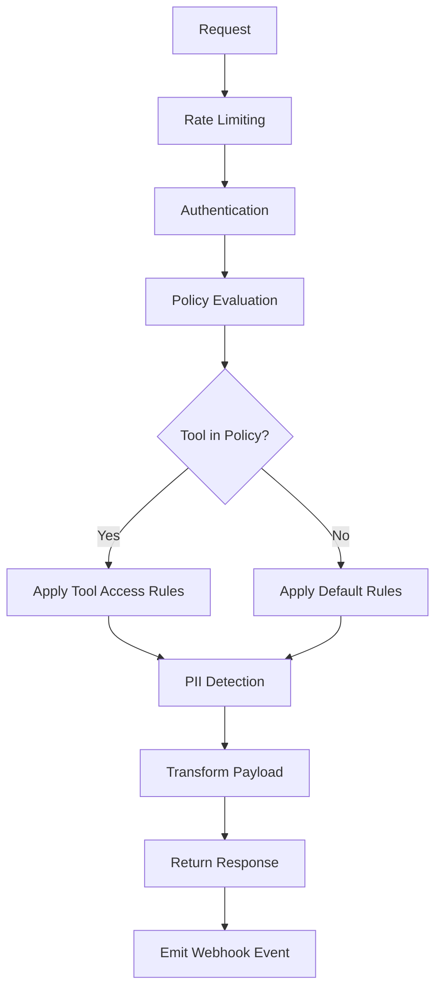
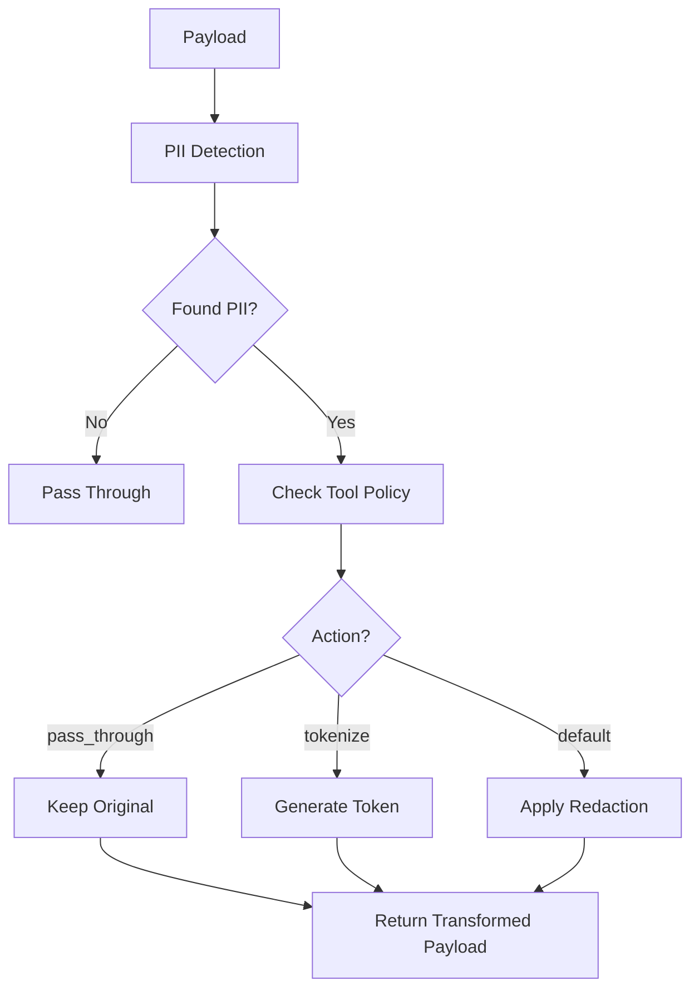

# GovernsAI Precheck - Project Specifications

## Overview

GovernsAI Precheck is a policy evaluation and PII redaction service that provides real-time policy decisions and data sanitization for AI tool interactions. The service supports per-tool PII access controls, allowing different tools to have specific rules for handling sensitive data.

## Core Features

### 1. Policy Evaluation Engine
- **Tool-based policies**: Different rules for different AI tools
- **Scope-based policies**: Network scope restrictions (e.g., `net.external`)
- **PII detection**: Advanced PII detection using Presidio with fallback to regex
- **Real-time decisions**: Fast policy evaluation with sub-second response times

### 2. Per-Tool PII Access Control
- **Tool-specific allowlists**: Configure which PII types each tool can access
- **Transform actions**: Support for `pass_through`, `tokenize`, and default redaction
- **Stable tokenization**: HMAC-based consistent token generation
- **Policy configuration**: YAML-based policy files for easy management

### 3. PII Detection & Redaction
- **Presidio integration**: Advanced NLP-based PII detection
- **Fallback detection**: Regex-based detection when Presidio unavailable
- **Multiple PII types**: Email, SSN, phone numbers, credit cards, API keys, JWT tokens
- **False positive filtering**: Context-aware filtering to reduce false positives

## API Endpoints

### Precheck Endpoint
```
POST /v1/u/{user_id}/precheck
```

**Purpose**: Evaluate policy and sanitize payload before tool execution

**Request**:
```json
{
  "tool": "verify_identity",
  "scope": "net.external",
  "payload": {
    "email": "alice@example.com",
    "ssn": "123-45-6789"
  },
  "corr_id": "req-123",
  "tags": ["urgent", "customer"]
}
```

**Response**:
```json
{
  "decision": "transform",
  "payload_out": {
    "email": "alice@example.com",
    "ssn": "pii_8797942a"
  },
  "reasons": [
    "pii.allowed:PII:email_address",
    "pii.tokenized:PII:us_ssn"
  ],
  "policy_id": "tool-access",
  "ts": 1758745697
}
```

### Postcheck Endpoint
```
POST /v1/u/{user_id}/postcheck
```

**Purpose**: Validate and sanitize payload after tool execution (egress)

**Request/Response**: Same format as precheck

### Health Check
```
GET /v1/health
```

**Response**:
```json
{
  "ok": true,
  "service": "governsai-precheck",
  "version": "0.0.1"
}
```

## Policy Configuration

### Tool Access Policy (`policy.tool_access.yaml`)

```yaml
version: v1
tool_access:
  verify_identity:
    direction: ingress         # only apply on precheck
    allow_pii:
      PII:email_address: pass_through  # tool may receive raw email
      PII:us_ssn: tokenize        # tool must get token, not raw
  send_marketing_email:
    direction: ingress
    allow_pii:
      PII:email_address: pass_through
  data_export:
    direction: egress          # only apply on postcheck
    allow_pii:
      PII:email_address: pass_through  # allow email in export
      PII:us_ssn: tokenize        # tokenize SSN in export
  audit_log:
    direction: egress          # only apply on postcheck
    allow_pii:
      PII:email_address: pass_through  # allow email in audit logs
      # SSN will be redacted (default behavior)
# default: everything else redacts/denies (your current behavior)
```

### Policy Actions

- **`pass_through`**: Allow raw PII value to pass through unchanged
- **`tokenize`**: Replace PII with stable token (e.g., `pii_8797942a`)
- **Default**: Apply standard redaction (e.g., `<USER_EMAIL>`, `<USER_SSN>`)

### Policy Directions

- **`ingress`**: Apply only on precheck (before tool execution)
- **`egress`**: Apply only on postcheck (after tool execution)

## PII Detection

### Supported PII Types

| PII Type | Presidio Entity | Example |
|----------|----------------|---------|
| Email | `EMAIL_ADDRESS` | `alice@example.com` |
| SSN | `US_SSN` | `123-45-6789` |
| Phone | `PHONE_NUMBER` | `+1-555-123-4567` |
| Credit Card | `CREDIT_CARD` | `4111-1111-1111-1111` |
| API Key | `API_KEY` | `sk-1234567890abcdef` |
| JWT Token | `JWT_TOKEN` | `eyJhbGciOiJIUzI1NiIs...` |

### Detection Methods

1. **Presidio (Primary)**: Advanced NLP-based detection with custom recognizers
2. **Regex (Fallback)**: Pattern-based detection when Presidio unavailable
3. **Context-aware filtering**: Reduces false positives based on field names and patterns

## Tokenization

### Stable Token Generation

```python
def tokenize(value: str) -> str:
    """Create a stable token for PII values"""
    return f"pii_{hashlib.sha256((TOKEN_SALT + value).encode()).hexdigest()[:8]}"
```

### Token Properties

- **Format**: `pii_{8-char-hash}`
- **Stable**: Same input always produces same token
- **Configurable salt**: Set via `PII_TOKEN_SALT` environment variable
- **Privacy-preserving**: Cannot reverse-engineer original value without salt

### Example Tokens

| Original Value | Token |
|----------------|-------|
| `alice@example.com` | `pii_a70ae1e6` |
| `123-45-6789` | `pii_8797942a` |
| `+1-555-123-4567` | `pii_b82c4f1d` |

## Architecture

### Core Components

```
app/
├── main.py          # FastAPI application entry point
├── api.py           # API endpoints and webhook handling
├── models.py        # Pydantic models for requests/responses
├── policies.py      # Policy evaluation and PII processing
├── auth.py          # API key authentication
├── rate_limit.py    # Rate limiting implementation
├── storage.py       # Data persistence layer
└── settings.py      # Configuration management
```

### Policy Evaluation Flow



### PII Processing Flow



## Configuration

### Environment Variables

| Variable | Description | Default |
|----------|-------------|---------|
| `PII_TOKEN_SALT` | Salt for token generation | `default-salt-change-in-production` |
| `PRECHECK_DLQ` | Dead letter queue path | `/tmp/precheck.dlq.jsonl` |
| `NEXT_WEBHOOK_URL` | Webhook URL for events | None |
| `USE_PRESIDIO` | Enable Presidio PII detection | `true` |
| `PRESIDIO_MODEL` | spaCy model for Presidio | `en_core_web_sm` |

### API Configuration

| Variable | Description | Default |
|----------|-------------|---------|
| `DEMO_API_KEY` | Demo API key for testing | `GAI_LOCAL_DEV_ABC` |
| `API_KEY_HEADER` | Header name for API key | `X-Governs-Key` |

## Security Features

### Authentication
- API key-based authentication
- Configurable API key header
- Demo key for development/testing

### Rate Limiting
- 100 requests per minute per user
- Configurable limits and windows
- Redis-based rate limiting (optional)

### PII Protection
- Multiple redaction strategies
- Stable tokenization for consistent processing
- Configurable salt for token generation
- False positive filtering

### Webhook Security
- Retry logic with exponential backoff
- Dead letter queue for failed deliveries
- Configurable timeout and retry attempts

## Deployment

### Dependencies

```toml
dependencies = [
    "fastapi>=0.104.0",
    "uvicorn[standard]>=0.24.0",
    "pydantic>=2.5.0",
    "pydantic-settings>=2.1.0",
    "presidio-analyzer>=2.2.0",
    "presidio-anonymizer>=2.2.0",
    "spacy>=3.7.0",
    "phonenumbers>=8.13.0",
    "sqlalchemy>=2.0.0",
    "psycopg2-binary>=2.9.0",
    "redis>=5.0.0",
    "python-multipart>=0.0.6",
    "pyyaml>=6.0.0",
]
```

### Running the Service

```bash
# Development
python -m uvicorn app.main:app --host 0.0.0.0 --port 8080 --reload

# Production
python -m uvicorn app.main:app --host 0.0.0.0 --port 8080
```

### Docker Support

```dockerfile
FROM python:3.11-slim
WORKDIR /app
COPY requirements.txt .
RUN pip install -r requirements.txt
COPY . .
CMD ["python", "-m", "uvicorn", "app.main:app", "--host", "0.0.0.0", "--port", "8080"]
```

## Testing

### Example Test Cases

#### Test 1: verify_identity tool
```bash
curl -X POST http://localhost:8080/v1/u/u1/precheck \
  -H "X-Governs-Key: GAI_LOCAL_DEV_ABC" \
  -H "Content-Type: application/json" \
  -d '{
    "tool": "verify_identity",
    "scope": "net.external",
    "payload": {
      "email": "alice@example.com",
      "ssn": "123-45-6789"
    },
    "corr_id": "req-123"
  }'
```

**Expected Response**:
```json
{
  "decision": "transform",
  "payload_out": {
    "email": "alice@example.com",
    "ssn": "pii_8797942a"
  },
  "reasons": [
    "pii.allowed:PII:email_address",
    "pii.tokenized:PII:us_ssn"
  ],
  "policy_id": "tool-access",
  "ts": 1758745697
}
```

#### Test 2: send_marketing_email tool
```bash
curl -X POST http://localhost:8080/v1/u/u1/precheck \
  -H "X-Governs-Key: GAI_LOCAL_DEV_ABC" \
  -H "Content-Type: application/json" \
  -d '{
    "tool": "send_marketing_email",
    "scope": "net.external",
    "payload": {
      "email": "alice@example.com",
      "ssn": "123-45-6789"
    },
    "corr_id": "req-124"
  }'
```

**Expected Response**:
```json
{
  "decision": "transform",
  "payload_out": {
    "email": "alice@example.com",
    "ssn": "<USER_SSN>"
  },
  "reasons": [
    "pii.allowed:PII:email_address",
    "pii.redacted:PII:us_ssn"
  ],
  "policy_id": "tool-access",
  "ts": 1758745697
}
```

#### Test 3: data_export tool (egress)
```bash
curl -X POST http://localhost:8080/v1/u/u1/postcheck \
  -H "X-Governs-Key: GAI_LOCAL_DEV_ABC" \
  -H "Content-Type: application/json" \
  -d '{
    "tool": "data_export",
    "scope": "net.external",
    "payload": {
      "email": "alice@example.com",
      "ssn": "123456789"
    },
    "corr_id": "req-125"
  }'
```

**Expected Response**:
```json
{
  "decision": "transform",
  "payload_out": {
    "email": "alice@example.com",
    "ssn": "pii_a70ae1e6"
  },
  "reasons": [
    "pii.allowed:PII:email_address",
    "pii.tokenized:PII:us_ssn"
  ],
  "policy_id": "tool-access",
  "ts": 1758748082
}
```

#### Test 4: audit_log tool (egress)
```bash
curl -X POST http://localhost:8080/v1/u/u1/postcheck \
  -H "X-Governs-Key: GAI_LOCAL_DEV_ABC" \
  -H "Content-Type: application/json" \
  -d '{
    "tool": "audit_log",
    "scope": "net.external",
    "payload": {
      "email": "alice@example.com",
      "ssn": "123456789"
    },
    "corr_id": "req-126"
  }'
```

**Expected Response**:
```json
{
  "decision": "transform",
  "payload_out": {
    "email": "alice@example.com",
    "ssn": "<USER_SSN>"
  },
  "reasons": [
    "pii.allowed:PII:email_address",
    "pii.redacted:PII:us_ssn"
  ],
  "policy_id": "tool-access",
  "ts": 1758748185
}
```

## Future Enhancements

### Planned Features

1. **Policy Hot-reload**: Reload policies without service restart
2. **Advanced Transformations**: Support for `mask`, `hash`, `remove` actions
3. **Policy Versioning**: Support for multiple policy versions
4. **Audit Logging**: Comprehensive audit trail for policy decisions
5. **Policy Templates**: Reusable policy templates for common patterns
6. **Bidirectional Policies**: Tools that need different rules for ingress vs egress

### Integration Opportunities

1. **Database Integration**: Store policies in database for dynamic updates
2. **External Policy Service**: Integration with external policy management systems
3. **Real-time Monitoring**: Integration with monitoring and alerting systems
4. **Policy Analytics**: Analytics and reporting on policy decisions

## Contributing

### Development Setup

1. Clone the repository
2. Install dependencies: `pip install -e .[dev]`
3. Install spaCy model: `python -m spacy download en_core_web_sm`
4. Run tests: `pytest`
5. Start development server: `python -m uvicorn app.main:app --reload`

### Code Style

- **Black**: Code formatting
- **isort**: Import sorting
- **flake8**: Linting
- **mypy**: Type checking

### Testing

- **pytest**: Test framework
- **pytest-asyncio**: Async test support
- **httpx**: HTTP client for API testing

## License

MIT License - see LICENSE file for details.

## Support

For questions, issues, or contributions, please refer to the project repository or contact the GovernsAI team.
